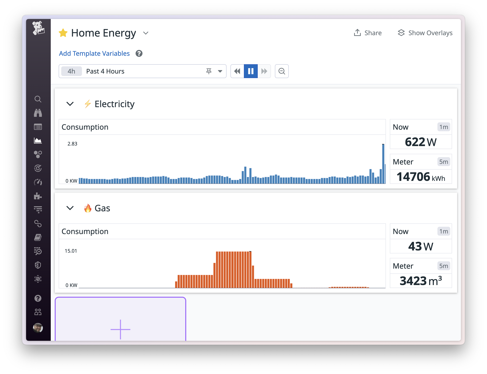

# geo-energy-datadog

A Go application that periodically queryies the [Geotogether](https://geotogether.com/) smart meter API and writes data to Datadog. It's written in such a way that it ought to be possible to plug in other inputs and outputs fairly easily.




## Getting started

```sh
export GEO_USERNAME="me@example.com"
export GEO_PASSWORD="<geotogether.com password here>"
export DD_API_KEY="<Datadog API key here>"
export DD_SITE="datadoghq.eu" # optional, defaults to datadoghq.com

go run .
```

## Using Docker

Create a `.env` file and populate it with the env variables above. Then:

```sh
docker compose up
```

## Storing secrets in 1Password

Set up an .env file similar to `.local.env` and `.prod.env` in this repo, then you can use `op run` or `op inject` to use those secrets at runtime. For example:

```sh
op run --env-file="./.mysecrets.env" -- go run .
```

Or to use the supplied Docker Compose file, you can either use `op run`:

```sh
op run --env-file="./.mysecrets.env" -- docker compose up
```

Or use `op inject` to populate a local `.env` file with your secrets:

```sh
op inject -i ./.mysecrets.env -o ./.env
docker compose up
```
